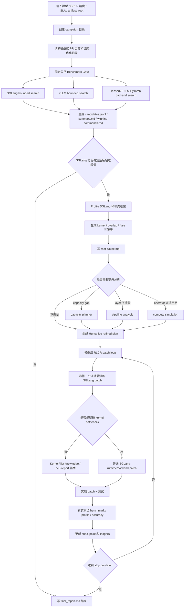

> SGLang SOTA Humanize Loop：让 Codex 自动追推理性能到 SOTA

# 0x0. 前言

先宣传一下这个仓库：AI-Infra-Auto-Driven-SKILLS(https://github.com/BBuf/AI-Infra-Auto-Driven-SKILLS) 是我最近在整理的一套面向 AI Infra / LLM Serving 的 Agent SKILLS。这里更偏可直接执行的工程 playbook，覆盖 SGLang、vLLM、TensorRT-LLM 的 benchmark，torch profiler 分析，SGLang PR review，线上 serving incident triage，模型优化 PR 历史知识库等等。如果你也在做推理框架开发，或者经常需要让 Agent 帮你跑 benchmark、看 profile、追性能、查历史 PR，可以先 star 一下这个仓库，后面我也会继续往里面补更多模型优化和生产排障相关的 SKILL。

安装也很简单。以 Codex 为例，可以直接把几个核心 skill 和模型 PR 历史知识库 symlink 到本地 skill 目录：

```bash
git clone https://github.com/BBuf/AI-Infra-Auto-Driven-SKILLS.git
cd AI-Infra-Auto-Driven-SKILLS

SKILL_DIR="${CODEX_HOME:-$HOME/.codex}/skills"
mkdir -p "$SKILL_DIR"

ln -s "$PWD/skills/llm-serving-auto-benchmark" "$SKILL_DIR/llm-serving-auto-benchmark"
ln -s "$PWD/skills/llm-torch-profiler-analysis" "$SKILL_DIR/llm-torch-profiler-analysis"
ln -s "$PWD/skills/sglang-humanize-review" "$SKILL_DIR/sglang-humanize-review"
ln -s "$PWD/skills/sglang-sota-humanize-loop" "$SKILL_DIR/sglang-sota-humanize-loop"
ln -s "$PWD/skills/sglang-prod-incident-triage" "$SKILL_DIR/sglang-prod-incident-triage"
ln -s "$PWD/skills/model-architecture-diagram" "$SKILL_DIR/model-architecture-diagram"
ln -s "$PWD/model-pr-optimization-history" "$SKILL_DIR/model-pr-history-knowledge"
```

这里要额外提醒一下：如果要真正跑 `sglang-sota-humanize-loop`，需要先安装 Humanize 相关的 skill，至少保证同一个 Agent 的 skill 目录里能看到 `humanize` 和 `humanize-rlcr`。这个 SOTA loop 依赖 Humanize/RLCR 来维护多轮 prompt、summary、review 和 checkpoint；没有这层 loop，前面的 benchmark/profile 流程仍然能读懂，但多轮自动推进会缺关键支撑。

如果是 Claude Code，把上面的 `SKILL_DIR` 换成 `~/.claude/skills` 即可；如果不想用软链接，也可以把 `ln -s` 换成 `cp -R`。安装后重启对应 Agent，在 `/skills` 里能看到 `llm-serving-auto-benchmark`、`llm-torch-profiler-analysis`、`sglang-sota-humanize-loop` 等名字，就说明已经生效。

这里也感谢一下 `changhuaixin` 最近提的 PR #60(https://github.com/BBuf/AI-Infra-Auto-Driven-SKILLS/pull/60)。这个 PR 给仓库补了三类独立的 LLM 性能分析 skill：`llm-pipeline-analysis`、`llm-serving-capacity-planner`、`model-compute-simulation`，分别覆盖 profiler trace 里的 layer/kernel timeline、GPU memory 容量规划、模型结构驱动的 FLOPs 和 MFU 估算。现在 `sglang-sota-humanize-loop` 的流程图里也有对应的可选分析分支：当 profile 只能说明慢在哪里，但还需要 layer、capacity 或 operator 级证据时，可以接到这些 skill 继续细化。

之前围绕 SGLang SKILL 写过几篇文章，例如 [Profile Analysis SKILL](https://mp.weixin.qq.com/s/5CiIf29C9EVSblfMVSJ--Q)、[Serving 排障 SKILL](https://mp.weixin.qq.com/s/H9__UceMcn7iwCSdpCWS-g)、[Humanize 带来的 Codex 使用范式变化](https://mp.weixin.qq.com/s/pScZ_9cA-6cWUPjfcGjNyg)。这些文章解决的更多是局部问题：怎么用三张表看 profile，怎么排 serving 故障，怎么让 Codex 在长任务里持续推进到该收尾的地方。

这篇要说的是更上层的一块：`sglang-sota-humanize-loop`。它处理的是一整条模型优化链路：给定一个模型、一个硬件预算、一组 workload，先做公平 benchmark，再 profile，再改 SGLang，最后把结果拉回同一套 workload 里验证。目标很明确，就是把 SGLang 追到当前环境下的最强 serving 性能。我现在主要验证的是单机 B200/H200；多机从流程上也可以接进来，只是暂时没有足够硬件条件完整验证。

这里最关键的变化是引入 Humanize/RLCR。普通 SKILL 更像一份作业指导书，告诉 Codex 这件事应该怎么做；Humanize 会把它变成一个有状态的工程循环。每轮有 prompt，有 summary，有 review，有 checkpoint。对于追 SOTA 这种任务，这一点很重要，因为跑完第一轮公平 benchmark 只是拿到起点，改完第一轮 patch 也只是进入下一次验证。下一轮该继续看哪个 profile row、哪些失败方向已经试过、是否需要重跑 accuracy，都需要被记录下来，当前对话窗口和人的记忆都只作为辅助。

这些性能 gap 的问题人当然也能做，只是又碎又耗时间。`sglang-sota-humanize-loop` 里面压进去的是一套性能追踪纪律：先固定公平基线，再判断 gap，再 profile 定位，再 patch，最后回到同一个 workload 复测。Codex + GPT-5.5 的优势是执行这套流程很快，而且可以把 benchmark、profile、失败尝试、最终 patch 都比较完整地落到 artifact 里。

前言最后再补一个使用建议。如果准备用 Codex + GPT-5.5 跑这个 skill，建议在可信工作区里把权限开到最高，再启用 fast 模式；长 benchmark、profile、patch、review 会频繁读写文件、拉服务、跑远端命令，权限和响应速度都会影响体验。也友情提示一下，这个 skill 的 token 消耗很猛。按后文 case 里的 prompt 卡片这种完整流程估算，一个 200 美元的 Codex + GPT-5.5 周额度可能只够跑 5 个模型左右，请一定关注自己的 token 消耗。我能保证的是，这些 token 会换成比较完整的 benchmark、profile、失败方向、patch 和复测证据。不同硬件、不同框架、不同数据集、不同 workload 都可以组合进来；在开源推理框架这个场景里，至少目前单机场景已经能覆盖模型级调优的大部分问题。kernel 层面的调优还有最后一公里，现在还很难让 Agent 轻松做到 kernel SOTA，这块仍然得靠老师傅看 profile、读源码、判断下一步该怎么动。

# 0x1. 这个 SKILL 在做什么

一句话总结：它先做固定公平 benchmark，再用 profile 找 root cause，最后进入 Humanize/RLCR 风格的模型级 patch loop，直到 SGLang 在固定 workload 和 SLA 下追平或超过最强 competitor。

这里有两个点很关键。

第一，benchmark 是固定的。SGLang 要做 bounded search，vLLM 也要做 bounded search，workload 在任务开始前就定住。默认会比较两个随机场景：

- `1000 -> 1000`，更接近普通 chat。
- `8000 -> 1000`，更接近长上下文 summarization。

每个场景默认 80 个 prompts，SGLang、vLLM、TensorRT-LLM 在同样模型、同样精度、同样 GPU 预算下各自搜索部署命令。失败 candidate 也要记录下来，失败原因同样进入表格。

第二，patch 要从证据开始。SGLang 如果落后超过稳定噪声阈值，就 profile SGLang 和领先框架，输出统一的三张表：

- kernel table：哪个 kernel family 占了多少 GPU time。
- overlap-opportunity table：哪些地方有 overlap 或 launch/headroom 空间。
- fuse-pattern table：哪些已知 fusion pattern 可能适用。

有了 root-cause 报告后，才进入 patch。kernel 优化、backend 默认值、MoE 路径、attention 路径、GDN/Mamba 路径，都会归到模型级 SGLang patch 这条线里。最后回到真实模型 benchmark 和必要的精度回归。

# 0x2. 流程图

下面是这个 SKILL 的流程图。核心思想是把 benchmark gate、profile gate、patch loop 和 final report 串成一条闭环。



这个图看起来长，但实际就是一句话：先证明差距，再定位差距，再改 SGLang，再用同一个真实 workload 验证。

# 0x3. Case 1: Qwen3.6-35B-A3B-FP8 在 B200 上的 GDN prefill 优化

第一个例子是 PR #7: Optimize GDN prefill split on B200(https://github.com/BBuf/sglang/pull/7)。

对应的 B200 prompt card 如下：

```text
使用 sglang-sota-humanize-loop skill。
model_id: Qwen/Qwen3.6-35B-A3B-FP8
root_dir: /Users/bbuf/工作目录/Common
target_hardware: single-node 1x NVIDIA B200
minimum_gpu_count: 1
precision_quantization: FP8
initial_deployment: SGLang TP=1, speculative MTP 只能在 1 卡预算内尝试
要求: 远端使用 ion-b200；SGLang 使用已有 sglang_bbuf 容器，容器内 repo 为 /home/sglang-omni/bbuf/repos/sglang。
要求: vLLM 和 TensorRT-LLM 直接使用最新镜像 vllm/vllm-openai:latest 与 nvcr.io/nvidia/tensorrt-llm/release:latest。
要求: 做环境准备时这台机器只执行一次 git pull；本任务开始前必须确认容器内 SGLang、vLLM、TensorRT-LLM 没有本地修改。
要求: 启动 Humanize/RLCR loop 时，必须在本地 Codex 会话里启动；远端 ion-b200 只能作为执行、benchmark、profile、验证环境。
要求: 每次 benchmark/profile 前必须确认这 1 张 B200 没有其他人的重负载进程，并记录 nvidia-smi、进程、显存、利用率、CUDA_VISIBLE_DEVICES。
要求: 只使用 1 张 B200；不要测试更多卡。
要求: 对 SGLang、vLLM、TensorRT-LLM 做同样 1 卡预算下的公平搜索；使用 skill 默认 workload。
要求: 如果 SGLang 稳定落后超过 1%，profile 后再 patch；重点看 hybrid reasoning、tool calling、MTP/speculative、decode latency。
要求: 如果需要提交 PR，只能 push/open 到 BBuf/sglang；不要 push 到或向 sgl-project/sglang 开 PR。
要求: 一个任务可以提交多个优化 PR 来推进模型性能；每个优化 PR 的 PR 描述都必须用表格给出性能 benchmark 对比，以及 GSM8K、MMLU 全量精度对比。
artifact_root: /Users/bbuf/工作目录/Common/opt_model/b200_qwen36_35b_a3b_fp8_sota_humanize
```

这个任务的模型是 `Qwen/Qwen3.6-35B-A3B-FP8`，硬件是单张 B200。固定公平搜索后，SGLang 本来已经比 vLLM 强：

| Framework / candidate | Chat 1000/1000 out tok/s | Long 8000/1000 out tok/s | 结论 |
| --- | ---: | ---: | --- |
| SGLang baseline best | 7205.38 | 4243.72 | 已经超过 vLLM |
| vLLM latest best | 6480.19 | 3993.22 | competitor best |
| TensorRT-LLM latest | N/A | N/A | latest image 不识别 `qwen3_5_moe` |

按传统做法，这里可能就结束了。但 SKILL 的流程会继续看 profile 证据，尤其是当模型路径里有 GDN/Mamba 这种容易出现 backend 差异的结构时。

profile 发现一个很具体的 gap：

| Profile row | Baseline SGLang | Patched SGLang | vLLM latest best |
| --- | ---: | ---: | ---: |
| `chunk_gated_delta_rule_fwd_kernel_h_blockdim64` | 269.00 us/launch | 218.78 us/launch | 228.34 us/launch |
| FLA/GDN prep copy | 18.97 ms | removed | no matching extra row |
| `fused_qkv_split_gdn_prefill_kernel` | N/A | 37.00 us/launch | N/A |

最后的 patch 做了两件事：

- 加了一个 Triton `fused_qkv_split_gdn_prefill_kernel`，把 GDN prefill 的 Q/K/V split 和 contiguous 写入合成一个 launch。
- 把 `chunk_gated_delta_rule_fwd_kernel_h_blockdim64` 的单配置调到 `BV=32, num_warps=4, num_stages=4`。

真实模型复测后：

| Framework / candidate | Chat out tok/s | Long out tok/s | 结论 |
| --- | ---: | ---: | --- |
| SGLang baseline best | 7205.38 | 4243.72 | baseline |
| SGLang patched GDN fused split + w4/s4 | 7396.73 | 4353.39 | Chat +2.66%，Long +2.58% |
| vLLM latest best | 6480.19 | 3993.22 | 已被 SGLang 拉开 |

精度也跑了全量回归：

| Variant | MMLU full | GSM8K full |
| --- | ---: | ---: |
| Baseline SGLang | 0.436761 | 0.954338 |
| Patched SGLang | 0.437687 | 0.955860 |

这个例子对应了 `sglang-sota-humanize-loop` 的典型路径：先从端到端 workload 进入，再由 profiler 定位到 GDN prefill gap，kernel patch 来自前面的证据链，最后回到真实模型验证。

# 0x4. Case 2: Qwen3.6-35B-A3B-FP8 在 H200 上追平 vLLM

第二个例子是 PR #6: Optimize Qwen3.6 FP8 serving on H200(https://github.com/BBuf/sglang/pull/6)。

对应的 H200 prompt card 如下：

```text
使用 sglang-sota-humanize-loop skill。
model_id: Qwen/Qwen3.6-35B-A3B-FP8
root_dir: /Users/bbuf/工作目录/Common
target_hardware: single-node 1x NVIDIA H200
minimum_gpu_count: 1
precision_quantization: FP8
initial_deployment: SGLang TP=1, speculative MTP 只能在 1 卡预算内尝试
要求: 远端使用 ion8-h200 或 ion9-h200；SGLang 使用已有 sglang_bbuf 容器，容器内 repo 为 /home/sglang-omni/bbuf/repos/sglang。
要求: vLLM 和 TensorRT-LLM 直接使用最新镜像 vllm/vllm-openai:latest 与 nvcr.io/nvidia/tensorrt-llm/release:latest。
要求: 做环境准备时这台机器只执行一次 git pull；本任务开始前必须确认容器内 SGLang、vLLM、TensorRT-LLM 没有本地修改。
要求: 启动 Humanize/RLCR loop 时，必须先 cd 到当前任务创建出的工程目录，也就是包含 .humanize 的目录，再启动 loop。
要求: 每次 benchmark/profile 前必须记录 nvidia-smi、GPU 进程、显存、利用率、CUDA_VISIBLE_DEVICES；如果这 1 张 H200 上有其他人的重负载进程，就等待、换另一张空闲 H200，或者停止并报告 blocker。
要求: 只使用 1 张 H200；不要测试任何更多卡部署。
要求: 对 SGLang、vLLM、TensorRT-LLM 做同样 1 卡预算下的公平搜索；使用 skill 默认 workload。
要求: 如果 SGLang 稳定落后超过 1%，profile 后再 patch；重点看 hybrid reasoning、tool calling、MTP/speculative、decode latency。
要求: 如果需要提交 PR，只能 push branch 并 open PR 到 BBuf/sglang；绝对不要 push 到或向 sgl-project/sglang 开 PR。
要求: 一个任务可以提交多个优化 PR 来推进模型性能；每个优化 PR 的 PR 描述都必须用表格给出性能 benchmark 对比，以及 GSM8K、MMLU 全量精度对比。
artifact_root: /Users/bbuf/工作目录/Common/opt_model/h200_qwen36_35b_a3b_fp8_sota_humanize
```

同一个模型到了 H200，瓶颈形态不一样。这个 PR 最后组合了三类 patch：

- H200 FP8 MoE Triton configs，覆盖 `E=256,N=512` 这类形状。
- FP8 compile/runtime 的 CUTLASS scaled-mm replacement path。
- Hopper 上 Qwen3.5/Qwen3.6 GDN prefill 默认切 FlashInfer，decode 保持 Triton。

固定 workload 下的结果如下：

| Scenario | Framework / config | Output tok/s | Result |
| --- | --- | ---: | --- |
| chat `1000->1000` | SGLang baseline `sglang_fa3` | 3194.33 | baseline |
| chat `1000->1000` | vLLM latest best `vllm_base` | 2860.68 | competitor |
| chat `1000->1000` | SGLang patched repeat | 3429.42 | +7.36% vs baseline，+19.88% vs vLLM |
| summarization `8000->1000` | SGLang baseline `sglang_extra_buffer` | 2305.11 | baseline |
| summarization `8000->1000` | vLLM latest best `vllm_chunked_prefill` | 2490.54 | competitor |
| summarization `8000->1000` | SGLang patched repeat | 2539.54 | +10.17% vs baseline，+1.97% vs vLLM |

这个 case 说明模型级 SOTA loop 的视角要放大一些。真正闭环时，可能需要 backend 默认值、编译替换、MoE config、GDN backend 几个点叠加。单个 patch 可能只解决 30% 的 gap，模型级 loop 最终关心的是同一 workload 下 SGLang 有没有追上。

这个 PR 里 full accuracy 没有完成，PR 描述里保留了 follow-up 表格。benchmark 和 accuracy 的证据分开记录，已完成和待补充的部分都写在 PR 里。

# 0x5. Case 3: Qwen3-Coder-Next-FP8 在 H200 上的 MoE/shared-expert 优化

第三个例子是 PR #5: Optimize Qwen3 Next FP8 MoE on H200(https://github.com/BBuf/sglang/pull/5)。

对应的 H200 prompt card 如下：

```text
使用 sglang-sota-humanize-loop skill。
model_id: Qwen/Qwen3-Coder-Next-FP8
root_dir: /Users/bbuf/工作目录/Common
target_hardware: single-node 1x NVIDIA H200
minimum_gpu_count: 1
precision_quantization: FP8
initial_deployment: SGLang TP=1, tool-call parser qwen3_coder
要求: 远端使用 ion8-h200 或 ion9-h200；SGLang 使用已有 sglang_bbuf 容器，容器内 repo 为 /home/sglang-omni/bbuf/repos/sglang。
要求: vLLM 和 TensorRT-LLM 直接使用最新镜像 vllm/vllm-openai:latest 与 nvcr.io/nvidia/tensorrt-llm/release:latest。
要求: 做环境准备时这台机器只执行一次 git pull；本任务开始前必须确认容器内 SGLang、vLLM、TensorRT-LLM 没有本地修改。
要求: 启动 Humanize/RLCR loop 时，必须先 cd 到当前任务创建出的工程目录，也就是包含 .humanize 的目录，再启动 loop。
要求: 每次 benchmark/profile 前必须记录 nvidia-smi、GPU 进程、显存、利用率、CUDA_VISIBLE_DEVICES；如果这 1 张 H200 上有其他人的重负载进程，就等待、换另一张空闲 H200，或者停止并报告 blocker。
要求: 只使用 1 张 H200；不要测试 TP2、TP4、TP8 或任何更多卡部署。
要求: 对 SGLang、vLLM、TensorRT-LLM 做同样 1 卡预算下的公平搜索；使用 skill 默认 random chat 1000/1000 和 random summarization 8000/1000 workload。
要求: 如果 SGLang 稳定落后超过 1%，profile SGLang 和领先框架的 prefill/decode，并基于证据进入 Humanize RLCR loop。
要求: 如果需要提交 PR，只能 push branch 并 open PR 到 BBuf/sglang；绝对不要 push 到或向 sgl-project/sglang 开 PR。
要求: 一个任务可以提交多个优化 PR 来推进模型性能；每个优化 PR 的 PR 描述都必须用表格给出性能 benchmark 对比，以及 GSM8K、MMLU 全量精度对比。
artifact_root: /Users/bbuf/工作目录/Common/opt_model/h200_qwen3_coder_next_fp8_sota_humanize
```

这个任务针对的是 `Qwen/Qwen3-Coder-Next-FP8`，单张 H200，TP=1。patch 主要包括：

- 为 Qwen3-Next FP8 MoE 开启 guarded CUDA shared-expert fusion。
- 把 `mlp.shared_expert.*` checkpoint 权重映射到 fused MoE expert slot。
- 新增 H200 FP8 Triton MoE configs，覆盖 fused `E=513,N=512` normal/down projection。
- 保持 opt-in，不影响已有 Qwen2-MoE 默认路径。

性能结果：

| Workload | Framework / Build | Output tok/s | p50 TTFT ms | p50 TPOT ms | Result |
| --- | --- | ---: | ---: | ---: | --- |
| Chat `1000/1000` | SGLang baseline | 3252.81 | 983.79 | 23.51 | baseline |
| Chat `1000/1000` | vLLM latest best | 3246.42 | 1520.49 | 23.07 | competitor |
| Chat `1000/1000` | SGLang patched | 3453.59 | 924.08 | 22.18 | ahead of vLLM |
| Summarization `8000/1000` | SGLang baseline | 2084.86 | 6880.61 | 31.48 | baseline |
| Summarization `8000/1000` | vLLM latest best | 2155.38 | 7288.98 | 29.38 | competitor |
| Summarization `8000/1000` | SGLang patched repeat | 2171.86 | 6636.10 | 30.19 | ahead of vLLM |

精度回归：

| Eval | Baseline score | Patched score | Delta | Baseline output tok/s | Patched output tok/s |
| --- | ---: | ---: | ---: | ---: | ---: |
| GSM8K 8-shot | 0.954996 | 0.945843 | -0.009153 | 1343.17 | 1606.32 |
| MMLU full | 0.874163 | 0.872098 | -0.002065 | 2730.73 | 2935.58 |

这个结果里性能明显提升，accuracy 有轻微波动，reviewer 需要结合阈值和模型用途判断是否可接受。SKILL 把 benchmark、accuracy 和 patch 信息放在同一个证据链里，方便后续 review。

# 0x6. 总结

从这几个 PR 看，`sglang-sota-humanize-loop` 已经可以把 Codex 从“帮我改一个文件”推进到“围绕一个模型追 SOTA”。

- PR #7 在 B200 上把 Qwen3.6 的 GDN prefill gap 通过 profiler 定位到具体 kernel/copy 路径，最终真实 workload 继续提速。
- PR #6 在 H200 上通过 MoE config、scaled-mm replacement、GDN backend 默认值组合，把 Qwen3.6 的 long workload 从落后 vLLM 拉到领先。
- PR #5 在 H200 上通过 Qwen3-Next shared-expert fusion 和 FP8 MoE config，让 SGLang 在 chat 和 long 两个场景都追到 vLLM 前面。

这些 case 展示的是一条系统化的推理框架优化流程：benchmark、profile、代码、精度、review、artifact 都放在同一个迭代链路里。CUDA kernel 能力仍然重要，但单点优化需要回到完整 serving workload 里验证。

前面的 Profile Analysis SKILL 负责把 profile 证据整理出来，Humanize 负责维持多轮 review 和 checkpoint，`sglang-sota-humanize-loop` 则把这两部分接到 SGLang 模型优化流程里，用同一套 workload 持续推进 benchmark、定位、patch 和复测。

# 0x7. 参考链接

- Humanize: https://github.com/PolyArch/humanize
- AI-Infra-Auto-Driven-SKILLS: https://github.com/BBuf/AI-Infra-Auto-Driven-SKILLS
- SGLang SOTA Humanize Loop Skill: https://github.com/BBuf/AI-Infra-Auto-Driven-SKILLS/tree/main/skills/sglang-sota-humanize-loop
- PR #60: https://github.com/BBuf/AI-Infra-Auto-Driven-SKILLS/pull/60
- PR #7: https://github.com/BBuf/sglang/pull/7
- PR #6: https://github.com/BBuf/sglang/pull/6
- PR #5: https://github.com/BBuf/sglang/pull/5
